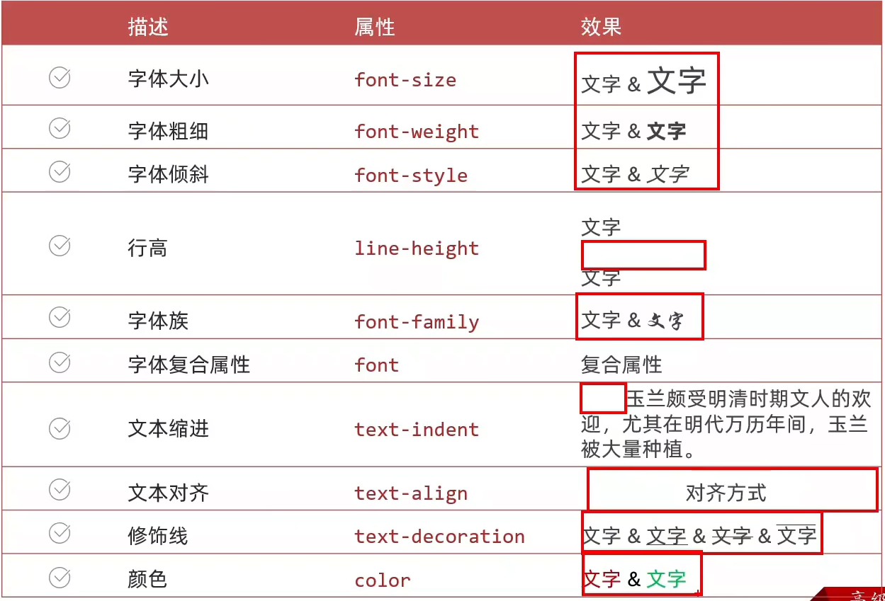

# CSS基础

> **视频来源：** [【B站】黑马程序员 - 前端Web开发HTML5+CSS3+移动web](https://www.bilibili.com/video/BV1kM4y127Li)<br>
> **观看进度：** P28 ~ P42<br>
> **日期：** 2025-08-24
---

## ✨ 核心观点 (The Gist)
了解了css的引入方式，以及相关选择器和对于字体，背景如何进行修饰，收获许多！
---

## 📝 我的笔记 (My Notes)
### 1.CSS引入方式
①内部样式表：
```html
<title>CSS</title>
 <style>
 </style>
```
②外部样式表
```html
<!-- rel:关系，样式表 -->
<link rel="stylesheet" href="./my.css">
```
③行内样式(配合js)
```html
<div style="color:red;font-size:30px;">标签</div>
```
### 2.选择器
* **①标签选择器**<br>
选中同名标签设置相同的样式，例如：p,h1,div,a,img;
```css
/* 特点：选中同名标签设置相同的样式，无法差异化同名标签的样式 */
p{
    color:red
}
```
* **②类选择器**<br>
  步骤：<br>
  1.定义类选择器->.类名<br>
  2.使用类选择器->标签添加class="类名"
```css
<style>
.red{
    color:red;
}
.size{
    font-size:20px;
}
</style>    
```
```html
<!--一个类选择器可以给多个标签使用 -->
<div class="red size">这是div标签</div>
 <!-- 一个标签可以有多个类名，class属性值写多个类名，类名用空格隔开  -->
```
* **③id选择器**
  一般配合JavaScript使用
```css
<style>
#red{
    color:red;
}
</style>
```
```html
<div id="red">这是div标签</div>
<!-- 同一个id选择器在一个页面只能使用一次 -->
```
* **④通配符选择器** 用于清除网页默认样式，间距之类的<br>
  id > class > 标签 > 通配符
```css
*{
    margin:0;
    padding:0;
}
```
### 3.文字修饰属性

* 行高和高度相同就可以使文字垂直居住（单行文字）
* font-family：font-family:Microsoft YaHei, Heiti sc, tahoma, arial, Hiragino Sans GB,"\5B8B\4F53",sans-serif;
* 复合属性：font:是否倾斜 是否加粗 字号/行高 字体（必须按顺序书写）（字号字体值必须书写）
* 文本缩进：1em(当前标签的字号大小)
---

## ❓ 问题与思考 (Questions & Thoughts)
*   **问题**
    *   ⏳还有许多其他不知道的对于字体和背景格式的修改，需要一步一步边做边学！
*   **想法和灵感**
    *   💡对于每个网页都需要用到CSS对网页的样式进行丰富，之后在做网页时遇到新的CSS格式要及时记录下来。

---